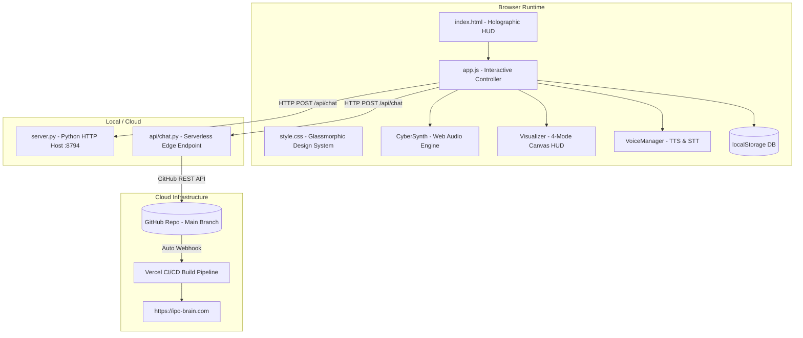

# 🛰️ SOVEREIGN MATRIX COMMAND HUB (LIL.JR 3.0)
## Complete Technical Handoff & Operational Architecture Document

---

## 1. Project Overview & Scope

The **Sovereign Matrix Command Platform** is a local-first, high-performance sci-fi HUD operating environment and autonomous AI workforce interface. It operates both locally as a zero-dependency standalone dashboard and in the cloud as a serverless application connected to continuous deployment pipelines.

- **Workspace Path**: `c:\Users\wjhmo\Downloads\ipo-brain (2)`
- **GitHub Repository**: `https://github.com/signsafepro-create/ipo-brain`
- **Production Domain**: `https://ipo-brain.com`
- **Local Development Server**: `http://localhost:8794`
- **Current Main Commit**: `c77042e`

---

## 2. System Architecture & Component Inventory



### File-by-File Breakdown

| File | Size | Description & Key Responsibilities |
| :--- | :--- | :--- |
| **`index.html`** | ~73 KB | Unified Single Page Application. Contains the sidebar conversation history, top navigation bar, model selector cards, chat message stream, composer bar with floating autocomplete, right-side metrics HUD, full-screen matrix overlay canvas, and the 5-tab presentation deck modal. |
| **`style.css`** | ~28 KB | Complete Cyber-Glass design system. Implements CSS custom properties for 3 core themes (*Nebula Core*, *Squadron 42*, *Amber Matrix*), backdrop blurs, scanline CRT filters, glowing borders, custom scrollbars, and responsive layouts. |
| **`app.js`** | ~38 KB | Core client-side engine. Contains `CyberSynth` (procedural audio FX + ambient drone), `Visualizer` (4 canvas modes), `VoiceManager` (SpeechSynthesis + SpeechRecognition), `SessionStore` (localStorage sync), CLI command parser, markdown/code formatter, and matrix rain animator. |
| **`server.py`** | ~4.8 KB | Multi-threaded local Python server (`ThreadingHTTPServer`) listening on port 8794. Serves all static directory assets and handles `/api/chat` JSON requests with autonomous build support. |
| **`api/chat.py`** | ~10 KB | Python serverless handler deployed on Vercel. Processes AI chat queries, detects autonomous code modification requests, interacts with the GitHub API to update files, and triggers live cloud rebuilds. |
| **`vercel.json`** | ~1 KB | Vercel deployment routes, static file serving rules, and Python serverless function mappings. |
| **`wrangler.toml`** | ~0.5 KB | Cloudflare Workers alternative deployment configuration. |
| **`README.md`** | ~2.6 KB | Quick-start guide, CLI trigger documentation, and feature summary. |

---

## 3. Subsystem Technical Specifications

### A. Procedural Audio Synthesizer (`CyberSynth`)
Engineered using the native Web Audio API (`AudioContext`):
- **Click Sound**: Sine wave sweeping from 900 Hz to 1600 Hz over 60ms.
- **Key-Tick**: Ultra-short 30ms randomized triangle wave (1200–1600 Hz) providing tactile keyboard feedback.
- **Success Chime**: 4-note ascending chord (C5 523Hz $\rightarrow$ E5 659Hz $\rightarrow$ G5 784Hz $\rightarrow$ C6 1046Hz).
- **Warning Alarm**: Sawtooth wave sliding down from 220 Hz to 160 Hz with rapid decay.
- **Ambient Drone**: Dual-oscillator sub-bass generator (55 Hz A1 sawtooth + 110.5 Hz detuned sine) passed through a 220 Hz low-pass filter. Toggleable via UI button or `/sound`.

### B. Multi-Mode Canvas Visualizer (`Visualizer`)
Real-time 60 FPS HTML5 canvas engine with 4 selectable visual styles:
1. **Spectrum (Equalizer)**: 32 vertical reactive frequency bars with gradient styling and white peak-hold meters.
2. **Waveform (Sine Curves)**: Dual-harmonic glowing sine waves dynamically modulating amplitude and frequency during speech and microphone capture.
3. **Matrix (Glyph Rain)**: Cascading Katakana and digital glyph streams with randomized drop rates.
4. **Core (Quantum Sphere)**: Breathing 30-node orbital particle sphere reacting to audio levels.

### C. Sovereign CLI Command Engine
The prompt composer supports immediate command execution and floating autocomplete:

| Command | Description | Action / Output |
| :--- | :--- | :--- |
| `/help` | Catalog | Displays all supported CLI commands and descriptions. |
| `/status` | Diagnostics | Returns real-time health checks on Core, Auto-Fix, Visualizer, and Synth. |
| `/scan` | Audit | Scans all workspace files, reporting sizes and integrity status. |
| `/compile` | Validation | Executes AST syntax and module compatibility smoke tests. |
| `/deploy` | Gate Check | Verifies release checklist readiness for production. |
| `/matrix` | Visual FX | Toggles full-screen cyber digital rain overlay animation. |
| `/sound` | Audio | Toggles the continuous ambient cyber synth drone. |
| `/diagnostics` | Telemetry | Outputs detailed CPU, VRAM, latency, and memory metrics. |
| `/benchmark` | Benchmark | Renders comparative latency and token throughput across all 4 models. |
| `/export` | Data Export | Generates and downloads the current chat log as a `.md` file. |
| `/clear` | Reset | Clears conversation history in the active session. |
| `/theme <name>` | Styling | Switches theme (`nebula`, `squadron`, `amber`). |

### D. Presentation Deck & ROI Studio (Inline Overlay Modal)
Accessible via the **"📊 Presentation Deck"** button:
- **Tab 1 (Slides)**: 5 interactive slides detailing Sovereign Agent OS, challenges, solutions, architecture, and roadmap.
- **Tab 2 (ROI Calculator)**: Interactive SVG cost-comparison graph computing cloud subscription burn vs. local sovereign setup.
- **Tab 3 (Swarm Sandbox)**: Simulated 103-micro-agent thread pool coordinator with task triggers.
- **Tab 4 (Blueprint Specs)**: Interactive 3D isometric SVG topology map with packet schemas and route definitions.
- **Tab 5 (Autonomous Studio)**: Live theme color preset swatches (Cyber Cyan, Neon Purple, Emerald, Amber Solar, Crimson) + prompt-to-git autonomous cloud build trigger.

---

## 4. Local Execution & Operations Guide

### Starting the Local Server
From the project directory in PowerShell or Terminal:
```powershell
python server.py
```
Server will start and bind to `0.0.0.0:8794`.

### Accessing the Application
- Main Interface: **[http://localhost:8794](http://localhost:8794)**
- Chat Endpoint: `POST http://localhost:8794/api/chat`

---

## 5. Cloud Deployment & CI/CD Pipeline

- **Repository**: Hosted at `signsafepro-create/ipo-brain` on branch `main`.
- **Hosting**: Connected to Vercel via automatic Git integration.
- **Deployment Process**: Any commit pushed to `origin/main` automatically triggers a Vercel build and updates `https://ipo-brain.com` within ~15 seconds.

---

## 6. Recent Commit & Forensic Log

```text
c77042e  feat: level up Sovereign Matrix with multi-mode visualizers, ambient drone synth, command autocomplete, and live theme studio [HEAD]
295f3f3  Revert "feat(autonomous): Shifted top-nav background to DARK RED"
9b76690  feat(autonomous): Shifted top-nav background to DARK RED
cf0238d  feat: add Autonomous Builder tab UI with live rebuild telemetry
9bff4ba  feat: enable build request detection and deterministic styles modifier
4a5e084  feat: implement advanced autonomous self-coding model (secretless)
ba5329a  fix: keep only high quality premium English voices
20bf7ae  fix: resolve touch blocking on mobile safari and private browsing localstorage errors
274f3d4  fix: bulletproof localStorage parsing and add cache invalidation scripts
a78fd49  feat: implement serverless /api/chat endpoint
6c00995  chore: override build commands in vercel.json
b7e4fb4  feat: Fix vercel deployment configuration
```

---
*Handoff document generated and verified for Sovereign Matrix Command Platform v3.0.*
