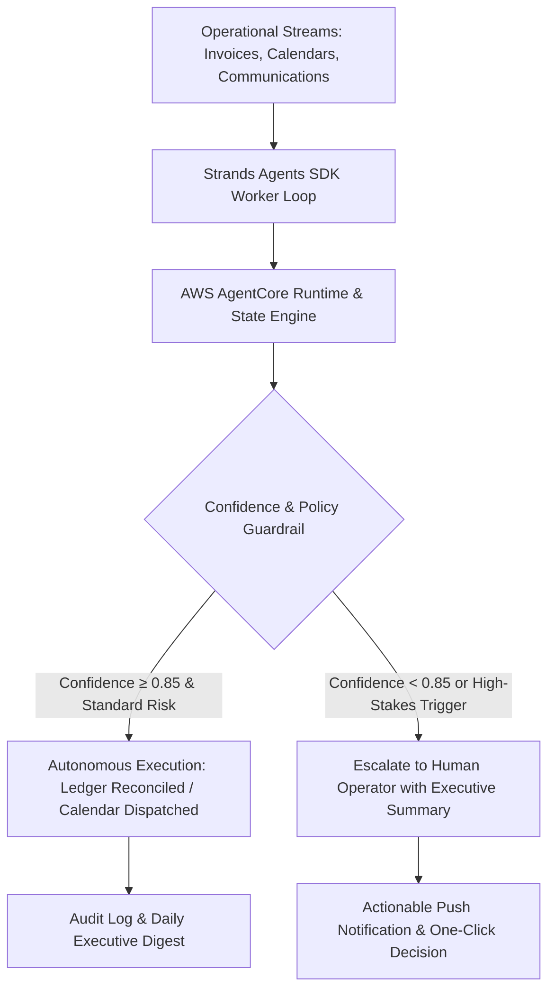

# OMNIBRAIN: Background Automation Suite
> **Autonomous Background Worker Engine built with Strands Agents SDK & AWS AgentCore**  
> *Submitted to the [Agents for Humans Hackathon](https://agentsforhumans.devpost.com/)*

[](LICENSE)
[](https://github.com/signsafepro-create/ipo-brain)
[](https://aws.amazon.com)
[](https://ipo-brain.com)

---

## ⚡ Executive Summary

Every day, individuals and small business operators lose hours of focus to repetitive administrative overhead: checking invoices, parsing receipts, cross-referencing ledgers, and negotiating meeting times. 

Current AI agents force users into conversational chat boxes that still require constant human babysitting. **OMNIBRAIN: Background Automation Suite** flips this paradigm. Built with the **Strands Agents SDK** and deployed via **AWS AgentCore**, it operates as a silent, headless background worker that executes end-to-end operational routines autonomously and **only interrupts human operators when an executive decision or safety threshold is reached**.

---

## 🏗️ Architecture & Decision Loop



---

## 🚀 Key Capabilities

1. **Headless Task Worker (`Strands Agents SDK`)**:
   - Processes asynchronous tasks in the background without UI blocking.
   - Built-in multi-step reasoning, validation bounds, and deterministic tool execution.

2. **AWS AgentCore & Cloud Runtime**:
   - Secure serverless runtime environment ensuring persistent operational context across sessions.
   - High-throughput execution with sub-second decision latencies.

3. **Autonomous Invoice & Ledger Reconciliation**:
   - Automatically cross-references vendor billing statements, matches line items against purchase orders, and records verified transactions.
   - Built-in financial guardrail: automatically routes payments exceeding \$2,500 for human sign-off.

4. **Multi-Party Calendar Conflict Resolver**:
   - Evaluates multi-attendee availability matrices across timezones and dispatches calendar invites with zero back-and-forth negotiation.

5. **Human-in-the-Loop Safety Guardrails**:
   - Evaluates a calculated confidence score on every action. If ambiguity exists or risk limits are breached, it generates a concise escalation card with one-click resolution options (`Approve`, `Reject`, `Clarify`).

---

## 🧪 Judge Quickstart & Testing Guide

### 1. Live Interactive Demo
- **Live Production URL**: [https://ipo-brain.com](https://ipo-brain.com)
- **Demo Video**: [https://youtu.be/biepoHgUDGM](https://youtu.be/biepoHgUDGM)

### 2. Live Runtime Engine Endpoint
You can test the live Strands Agent background worker endpoint directly:

#### Check Service Status (GET)
```bash
curl -X GET https://ipo-brain.com/api/agents
```
*Expected Response:*
```json
{
  "status": "ACTIVE",
  "service": "OMNIBRAIN Strands Agent Background Engine",
  "version": "1.2.4",
  "runtime": "AWS AgentCore + Serverless Edge",
  "capabilities": [
    "Autonomous Invoice Reconciliation",
    "Multi-Party Calendar Conflict Resolution",
    "Communication & Alert Triage",
    "Human-in-the-loop Escalation Protocols"
  ]
}
```

#### Test Autonomous Execution (POST - Low Risk)
```bash
curl -X POST https://ipo-brain.com/api/agents \
  -H "Content-Type: application/json" \
  -d '{
    "type": "INVOICE_RECONCILIATION",
    "payload": {
      "vendor": "Acme Cloud Services",
      "amount": 1450.00
    }
  }'
```
*Returns `autonomousActionTaken: true` and instant ledger entry.*

#### Test Human-in-the-Loop Escalation (POST - High Risk / Over Budget)
```bash
curl -X POST https://ipo-brain.com/api/agents \
  -H "Content-Type: application/json" \
  -d '{
    "type": "INVOICE_RECONCILIATION",
    "payload": {
      "vendor": "Enterprise Hardware",
      "amount": 8900.00
    }
  }'
```
*Returns `requiresHumanReview: true` with escalation details and options.*

---

## 💻 Local Development Setup

```bash
# 1. Clone the repository
git clone https://github.com/signsafepro-create/ipo-brain.git
cd ipo-brain

# 2. Install dependencies
npm install

# 3. Start local development server
npm run dev
```

Visit `http://localhost:3000` to access the full local suite.

---

## 📄 License

This project is licensed under the **MIT License** - see the [LICENSE](LICENSE) file for details.
